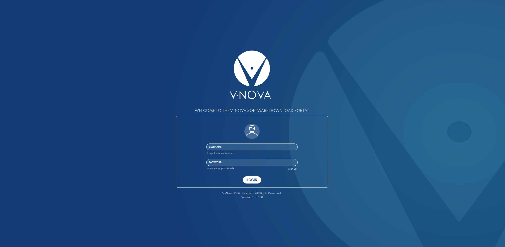
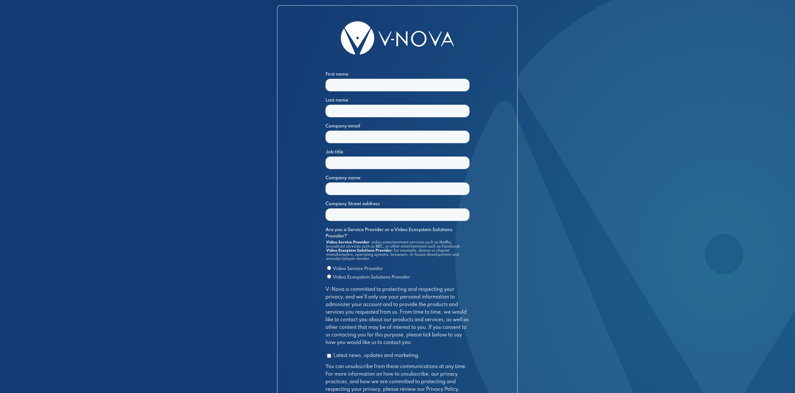
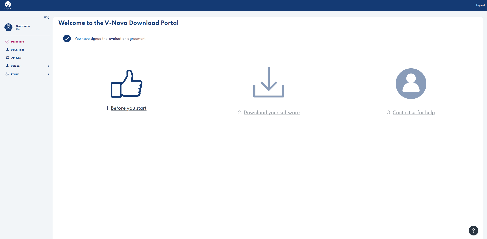
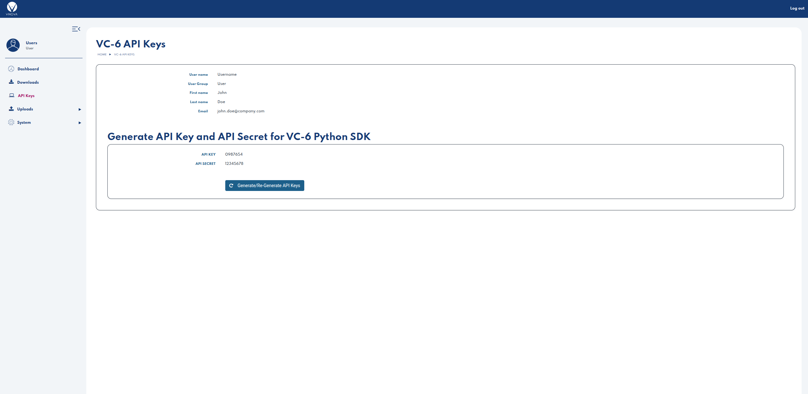

# VC-6 Samples
VC-6 Python SDK – Sample Scripts License: BSD-3-Clause-Clear (see LICENSE) Ownership: © 2014–2025 V-Nova International Limited Distribution: Made available by V-Nova Limited, a wholly owned subsidiary of V-Nova International Limited.

Note: This repository contains sample Python scripts only. It does not include VC-6 SDK wheels, installers, or license keys

Reference samples for V-Nova's SMPTE VC-6 codec python module.
These samples demonstrate how to encode, decode, and validate VC-6's functionality and performance.


## VC-6 Python SDK

## Requirements
   - Python 3.10+ recommended
   - VC-6 Python SDK wheel (download from the V-Nova portal)
   - A valid VC-6 license activation key and secret

```cmd
pip install -r requirements.txt
```
## Get SDK & Keys

Follow these steps:

1. Sign up and accept the EULA at the V-Nova Download Portal. [V‑Nova Download Portal](https://download.v-nova.com).
2. Obtain your SDK wheel(s) and your API Key and Secret.
3. Do not commit or share license credentials; treat them as secrets.
4. If you need to rotate a compromised key, contact ai@v-nova.com.
5. Treat your VC-6 API Key and Secret as credentials; don’t publish or commit them.

💡 Tip: Setting these variables avoids interactive prompts when running the SDK.

```cmd
export VC6_LICENSE_ACTIVATION_KEY=<your_api_key>
export VC6_LICENSE_ACTIVATION_PASSWORD=<your_api_secret>
```


### V-Nova Download Portal : [https://download.v-nova.com](https://download.v-nova.com)


### Sign-up to Download Portal


### Sign EULA


### Get API Key and API Secret


## Samples

### 1. Encoding:
   - VC-6 CPU Encoder.
   - VC-6 OpenCL GPU Encoder.

### 2. Decoding:
   - VC-6 CPU Decoder.
   - VC-6 OpenCL GPU Decoder.
   - VC-6 CUDA GPU Decoder.
   - VC-6 CUDA GPU Decoder with partial fetch.
   - VC-6 CUDA GPU Decoder with Region of Interest Decoding.
   - VC-6 CUDA GPU Decoder with CUDA Memory to resize with Nvidia DALI.


## Contributing (temporarily closed)
We’re not accepting external contributions right now. We may open issues and pull requests in the future—watch or star this repo for updates.
If you plan to contribute later, include this header at the top of each new source file:
```cmd
# SPDX-License-Identifier: BSD-3-Clause-Clear
# Copyright (c) 2014-2025 V-Nova International Limited
```

## Security
If you believe you’ve found a vulnerability in these samples, email ai@v-nova.com with details and a reproducible example if possible. Please do not open public issues for sensitive reports.

## Support / questions 
For now, please contact ai@v-nova.com. We’ll enable GitHub Issues when contributions open.

## Install Python SDK

```cmd
pip install wheel vc6_opencl-7.16.0-cp38-abi3-win_amd64.whl
```
## Configure VC-6 Codec

```cmd
$ python decode/opencl_decoder.py -s source_dir -d destination_dir

V-Nova VC-6 Python SDK License Activation Required
=====================================================

To use the SDK, you need to provide your VC-6 API credentials.

1. Get your **VC-6 API Key** and **VC-6 API Secret** from:
    https://download.v-nova.com

2. If you already have credentials, set them as environment variables:

   export VC6_LICENSE_ACTIVATION_KEY=<your_api_key>
   export VC6_LICENSE_ACTIVATION_PASSWORD=<your_api_secret>

💡 Tip: Setting these variables avoids interactive prompts when running the SDK.


Enter VC6_LICENSE_ACTIVATION_KEY: xxxxxxx
Enter VC6_LICENSE_ACTIVATION_PASSWORD: xxxxxxx
```

## Run Samples
```cmd
$ python decode/decode_resize_cuda_memory_dali.py --help


usage: decode_resize_cuda_memory_dali.py [--help] [-w MAXWIDTH] [-h MAXHEIGHT] [-b BATCH] [-l LOQ] [-rw RESIZEWIDTH] [-rh RESIZEHEIGHT] -s SOURCE -d DESTINATION_DIR

Decode all VC-6 images in a directory (or single VC-6 image) to Raw RGB format and resize using Nvidia DALI.

options:
  --help                Show this help message and exit
  -w MAXWIDTH, --maxwidth MAXWIDTH
                        Maximum width of images (default: 2048)
  -h MAXHEIGHT, --maxheight MAXHEIGHT
                        Maximum height of images (default: 2048)
  -b BATCH, --batch BATCH
                        Batch size for decode (default: 10)
  -l LOQ, --loq LOQ     Level of Quality LOQ (default: 0)
  -rw RESIZEWIDTH, --resizewidth RESIZEWIDTH
                        Resize Width (default: 224)
  -rh RESIZEHEIGHT, --resizeheight RESIZEHEIGHT
                        Resize height (default: 224)
  -s SOURCE, --source SOURCE
                        Path to source directory containing images, or a single image file
  -d DESTINATION_DIR, --destination-dir DESTINATION_DIR
                        Directory to write decoded files
```

# VC-6 Documentation
 
## Installation 
 The only requirement is Python 3.8 or above.
 Install the package via the provided wheel compatible with your platform and architecture.
 For example, the OpenCL-accelerated codec for Windows (x86): 

```cmd
pip install wheel vc6_opencl-7.16.0-cp38-abi3-win_amd64.whl
```

## Usage

Main codec functionality is inside the `codec` module that can be imported as follow:

```python
from `vnova.vc6_opencl` import `codec` as vc6codec
```

or, if you have installed the CUDA codec:

```python
from `vnova.vc6_cuda12` import `codec` as vc6codec
```

Then, you can create codecs and start transcoding. For complete examples, see the provided sample codes:

```python
# setup encoder and decoder instances
    encoder = vc6codec.EncoderSync(
        1920, 1080, vc6codec.CodecBackendType.CPU, vc6codec.PictureFormat.RGB_8, vc6.ImageMemoryType.CPU)
    encoder.set_generic_preset(vc6codec.EncoderGenericPreset.LOSSLESS)
    # Using double resolution to demonstrate reconfiguration later
    decoder = vc6codec.DecoderSync(1920, 1080, vc6codec.CodecBackendType.CPU, vc6codec.PictureFormat.RGB_8, vc6codec.ImageMemoryType.CPU)
    # encode file to memory
    encoded_image = encoder.read("example_1920x1080_rgb8.rgb")
    # decode memory to memory
    decoded_image = decoder.write(encoded_image.memoryview, "reconstruction_example_1920x1080_rgb8.rgb")
```

### GPU memory output
When using our CUDA package (`vc6_cuda12`), the decoder output can be device memory.
To use this feature, create the decoder with specifying `GPU_DEVICE` as the output memory type.
With that, the output images will have `__cuda_array_interface__` and can be used with other libraries like CuPy, PyTorch and nvImageCodec.

```python
    import cupy
    # setup GPU decoder instances with CUDA device output
    decoder = vc6codec.DecoderSync(1920, 1080, vc6codec.CodecBackendType.CPU, vc6codec.PictureFormat.RGB_8, vc6codec.ImageMemoryType.CUDA_DEVICE)
    # decode from file
    decoded_image = decoder.read("example_1920x1080_rgb8.vc6")
    # Make a cupy array from decoded image, download to cpu and write to file
    cuarray = cupy.asarray(decoded_image)
    with open("reconstruction_example_1920x1080_rgb8.rgb") as decoded_file: 
        decoded_file.write(cuarray.get(), "reconstruction_example_1920x1080_rgb8.rgb")
```

Both for sync and async decoders, accessing `__cuda_array_interface__` is blocking and implicitly waits on the result to be ready in the image.

The `__cuda_array_interface__` always contains one-dimensional data of unsigned-8bit type like the CPU version.
Adjusting dimensions (or the type in case of 10-bit formats) is up to the user.  

### environment variables:

Environment variables `OCL_BIN_LOC` and `OCL_DEVICE` can be set to define the GPU binary cache location, and hint for selecting target GPU, respectively.
For more details refer to [VC6-SDK documentation](https://docs.v-nova.com/technologies/smpte.vc-6/).

```cmd
export OCL_BIN_LOC=./tmp/clbin
export OCL_DEVICE=nvidia
```
Variable `CUDA_BIN_LOC` serves the same purpose for the CUDA version:

```cmd
export CUDA_BIN_LOC=./tmp/clbin
```
